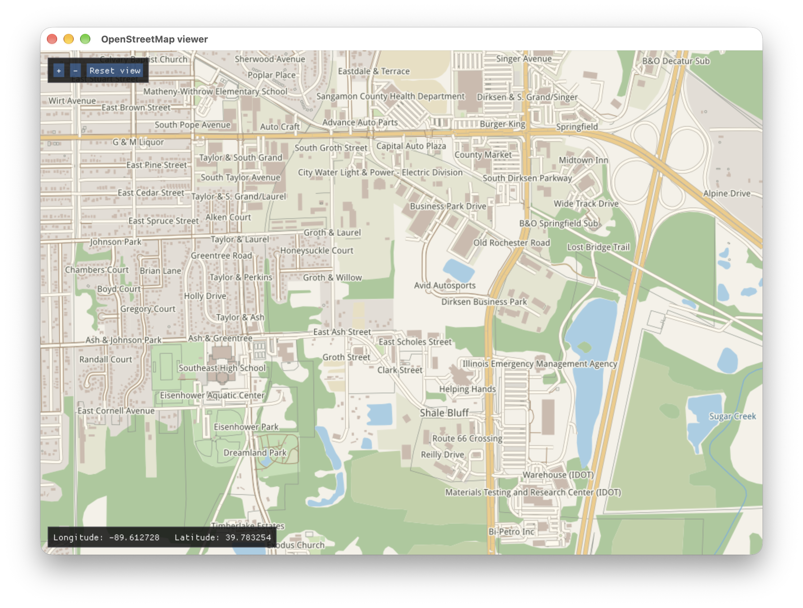

# OpenStreetMap renderer and viewer

This repository contains an OpenStreetMap renderer based on [Blend2d](https://blend2d.com). It loads maps in XML (`.osm`) format and renders the entire pat or its region into a Blend2d image.

The viewer provided displays the rendered map via [SDL3](https://github.com/libsdl-org/SDL) and [ImGui](https://github.com/ocornut/imgui).



## Build and run

All dependencies are included in this repository.

```sh
cmake -S . -B build
cmake --build build -j
ctest --test-dir build --output-on-failure
./build/viewer/viewer map.osm
```

To export the image without opening a window:

```sh
./build/viewer/viewer map.osm --snapshot map-preview.png
```

## Small-feature level of detail

Rendering skips filled buildings and land-use polygons when both full feature
bounds are smaller than 2 target-image pixels. Their labels are skipped too.
Zooming in or increasing image resolution restores the detail automatically.
Roads, waterways, long narrow polygons, and holes in retained multipolygons are
preserved. This first LOD stage does not simplify vertices or add a spatial index;
the cached feature lists are still scanned each frame.

The existing `render(context, region)` call enables LOD by default. To tune it or
compare with full detail:

```cpp
osm::Map::RenderOptions options;
options.m_minAreaSizePixels = 0; // Disable LOD; default is 2.0.
osm::Map::RenderStats stats;
auto result = map.render(context, region, options, &stats);
```

Stats count fill features considered, offscreen, culled by LOD, and submitted for
drawing; each complete multipolygon counts once. They reset on every call.
Run `./build/tests/osm_tests lod` for regression coverage and illustrative render
timings at three scales on a synthetic map containing 10,000 buildings. Timings
are diagnostic, not pass/fail limits. Removing tiny buildings can reduce urban
texture at broad scales; adjust the threshold when that detail matters.
